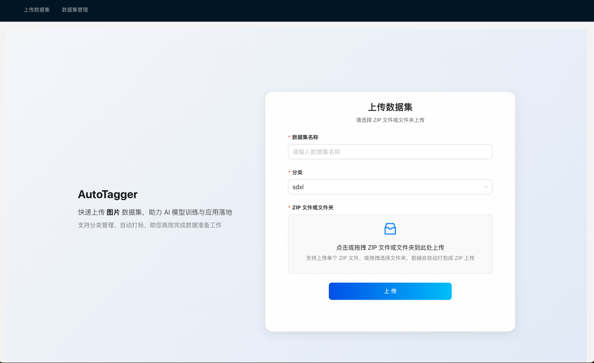
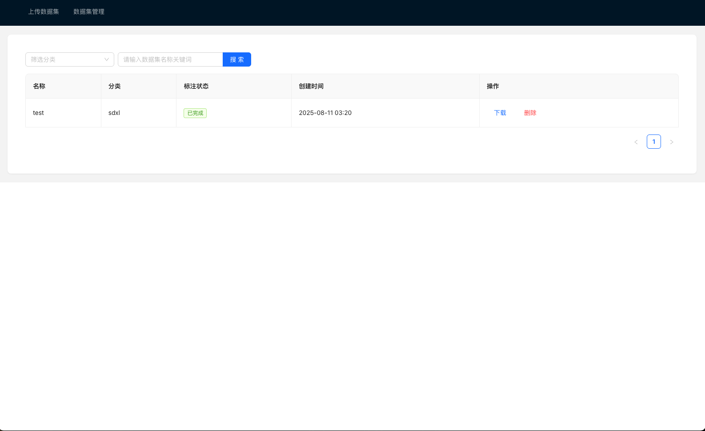

# AutoLabel - AI图像自动标注系统

## 项目
图像自动标注工具，支持SDXL和Flux两种标注模式，可自动生成图片描述标签。

### 数据上传界面



### 数据集管理界面



## 配置文件说明
配置文件位于`config.yaml`，主要配置如下：

### 1. S3存储配置
```yaml
s3:
  endpoint_url: "http://host.docker.internal:9000" # MinIO地址
  region_name: "us-east-1"
  access_key: "minioadmin"       # 访问密钥
  secret_key: "minioadmin"       # 私有密钥
  bucket: "ai-dataset"           # 存储桶名称
```

### 2. MongoDB配置
```yaml
mongo:
  uri: "mongodb://host.docker.internal:27017" # MongoDB地址
  database: "ai-dataset"         # 数据库名称
```

### 3. Redis配置
```yaml
redis:
  host: "host.docker.internal"   # Redis地址
  port: "6379"                   # Redis端口
  password: ""                   # 认证密码
  database: 0                    # 数据库索引
```

### 4. 视觉大模型配置（可选，默认使用wd-tagger模型进行标注）
```yaml
VLM:
  api_key: ""                    # 阿里云API密钥
  base_url: "https://dashscope.aliyuncs.com/compatible-mode/v1"
  model_name: "qwen-vl-max"      # 模型名称
```

## 配置修改指南
1. 修改服务地址：
   - 本地机服务默认 `host.docker.internal`
   - 生产环境替换为实际IP/域名

2. 认证信息：
   - 修改S3/MongoDB/Redis的访问凭证
   - 添加阿里云API密钥

3. 重启服务使配置生效：
```bash
docker-compose restart
```

## 快速开始
```bash
# 启动所有服务
docker-compose up --build -d

# 访问服务
Web界面: http://localhost:3000
API文档: http://localhost:6060/docs
```

## 项目结构
```
├── config.yaml       # 主配置文件
├── api/              # API服务
├── web/              # 前端界面
└── utils/            # 模型实现
